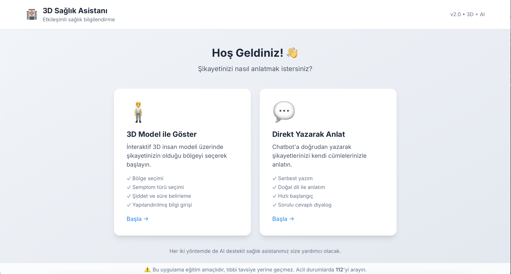
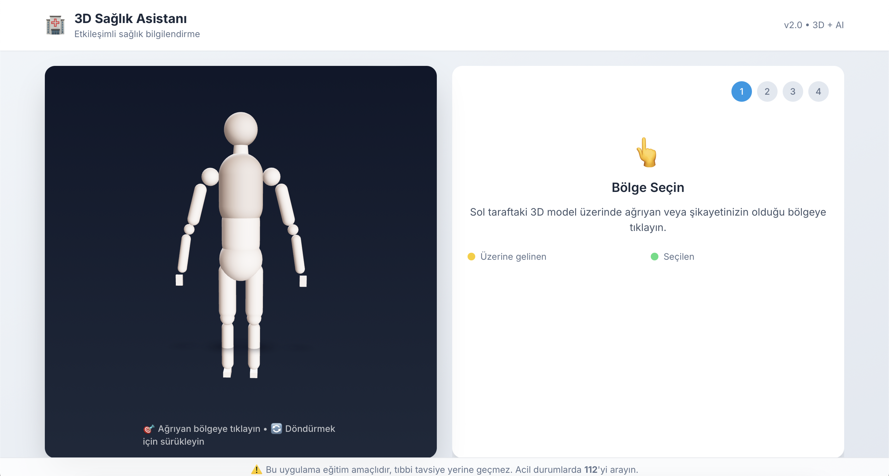
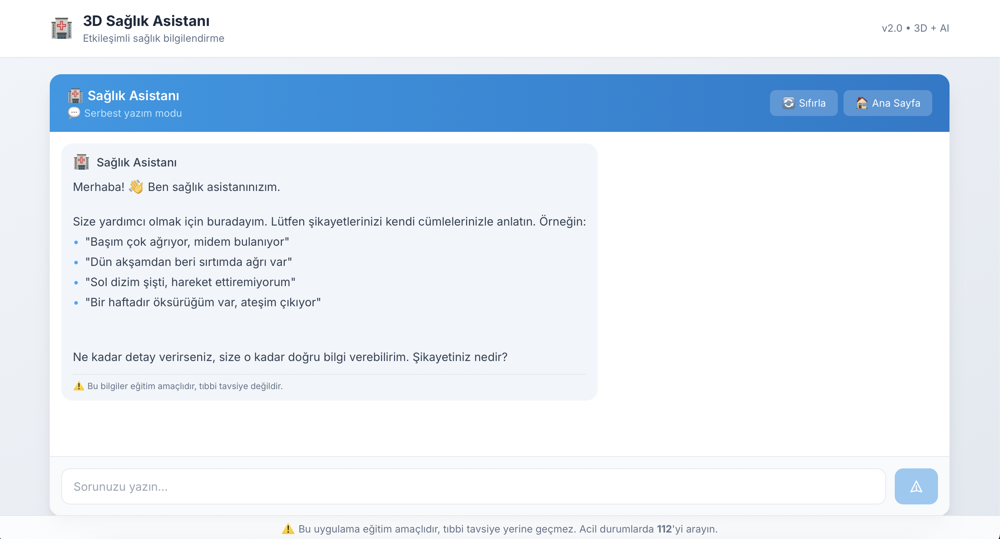

# 🏥 3D Medical Chatbot - Sağlık Asistanı

Türkçe sağlık odaklı bilgilendirme chatbot'u. 3D insan modeli üzerinde etkileşimli bölge seçimi veya direkt sohbet ile AI destekli sağlık bilgilendirme.

> ⚠️ **Önemli:** Bu uygulama teşhis koymaz, sadece bilgilendirme ve yönlendirme yapar.

## 📸 Ekran Görüntüleri

### Hoş Geldin Ekranı
Kullanıcılar iki farklı mod arasında seçim yapabilir: 3D Model ile göster veya Direkt yazarak anlat.



### 3D Model ile Bölge Seçimi
İnteraktif 3D insan modeli üzerinde ağrıyan veya şikayetin olduğu bölgeye tıklayarak başlayın.



### Serbest Yazım Modu (Chat)
Chatbot'a doğrudan yazarak şikayetlerinizi kendi cümlelerinizle anlatın.



## ✨ Özellikler

### İki Farklı Etkileşim Modu
- **🧍 3D Model ile Göster** - 24 farklı vücut bölgesi, yapısal semptom seçimi, şiddet skalası
- **💬 Direkt Yazarak Anlat** - Serbest metin girişi ile doğal dil anlatımı

### Chatbot Özellikleri
- ✅ **RAG (Retrieval-Augmented Generation)** - Tıbbi bilgi tabanı ile zenginleştirilmiş yanıtlar
- ✅ Türkçe ilaç ismi tanıma (117+ ilaç, typo düzeltme, ek kırpma)
- ✅ Çoklu kelime ilaç tespiti (tylol hot, aferin forte)
- ✅ Sağlık dışı soruları filtreleme (hard/soft ayrımı)
- ✅ Acil durum tespiti ve 112 yönlendirmesi
- ✅ Groq LLM + Translation Pipeline (TR → EN → LLM → TR)
- ✅ LLM tabanlı yüksek kaliteli Türkçe çeviri

### X-ray Görüntü Analizi
- ✅ **Akciğer X-ray Analizi** - DenseNet121 tabanlı derin öğrenme modeli
- ✅ 14 farklı akciğer patolojisi tespiti
- ✅ **GradCAM** ile görsel açıklama (hangi bölgeye bakıldığını gösterir)
- ✅ Türkçe sonuç ve açıklamalar

## 🛠️ Teknoloji Stack

| Frontend | Backend | RAG | Image Analysis |
|----------|---------|-----|----------------|
| React 18 + TypeScript | FastAPI | FAISS Vector Store | PyTorch |
| Three.js (@react-three/fiber) | Groq LLM (Llama 3.3) | Sentence Transformers | DenseNet121 |
| Zustand | Deep Translator | Medical Knowledge Base | GradCAM |
| Tailwind CSS | Pydantic | Semantic Search | PIL/OpenCV |

## 📁 Proje Yapısı

```
medical_chatbot/
├── backend/
│   ├── app/
│   │   ├── main.py           # FastAPI ana uygulama
│   │   ├── health_filter.py  # Sağlık/acil durum filtresi
│   │   ├── medicines.py      # İlaç veritabanı (tek kaynak)
│   │   ├── prompts.py        # LLM prompt şablonları
│   │   ├── image/            # X-ray Görüntü Analizi Modülü
│   │   │   ├── router.py     # Image API endpoint'leri
│   │   │   ├── model.py      # DenseNet121 model tanımı
│   │   │   ├── inference.py  # Model inference
│   │   │   ├── gradcam.py    # GradCAM görsel açıklama
│   │   │   ├── preprocessing.py  # Görüntü ön işleme
│   │   │   └── config.py     # Konfigürasyon
│   │   └── rag/              # RAG Modülü
│   │       ├── router.py     # RAG API endpoint'leri
│   │       ├── rag_chain.py  # RAG zinciri ve LLM entegrasyonu
│   │       ├── knowledge_base.py  # Tıbbi bilgi tabanı
│   │       ├── vector_store.py    # FAISS vektör deposu
│   │       └── embeddings.py      # Sentence Transformers
│   ├── scripts/
│   │   ├── etl/              # ETL Pipeline
│   │   │   ├── medlineplus_etl.py  # MedlinePlus veri çıkarma
│   │   │   ├── openfda_etl.py      # OpenFDA veri çıkarma
│   │   │   ├── clean_enrich.py     # Temizleme ve zenginleştirme
│   │   │   └── run_etl.py          # Ana ETL çalıştırıcı
│   │   └── evaluate_rag.py   # RAG performans değerlendirme
│   └── data/
│       └── medical_knowledge/    # Tıbbi bilgi JSON dosyaları
│           ├── symptoms_diseases.json
│           ├── symptoms_diseases_medlineplus_tr_enriched.json
│           ├── medications.json
│           └── emergency.json
├── frontend-3d/
│   └── src/
│       ├── components/
│       │   ├── HumanModel/   # 3D insan modeli
│       │   ├── ChatPanel/    # Sohbet paneli
│       │   ├── SymptomPanel/ # Semptom seçimi
│       │   └── ImageAnalysis/  # X-ray analiz arayüzü
│       ├── store/            # Zustand state management
│       └── data/             # Vücut bölgeleri verisi
└── docs/screenshots/
```

## 🚀 Kurulum

### 1. Groq API Key
[Groq Console](https://console.groq.com/)'dan ücretsiz API key alın.

### 2. Backend
```bash
cd backend
python3 -m venv venv && source venv/bin/activate
pip install -r requirements.txt
echo "GROQ_API_KEY=your_key" > .env
```

### 3. Frontend
```bash
cd frontend-3d
npm install
```

### 4. Çalıştır
```bash
# Terminal 1 - Backend
cd backend && source venv/bin/activate && uvicorn app.main:app --port 8000

# Terminal 2 - Frontend
cd frontend-3d && npm run dev
```

Tarayıcıda: **http://localhost:3000**

## 📡 API Endpoints

| Endpoint | Açıklama |
|----------|----------|
| POST /chat | Ana sohbet endpoint'i |
| POST /rag/chat | RAG destekli sohbet endpoint'i |
| POST /rag/search | Bilgi tabanında arama |
| GET /rag/stats | RAG istatistikleri |
| POST /image/analyze | X-ray görüntü analizi |
| GET /image/info | Model bilgisi |
| GET /health | API sağlık kontrolü |
| GET /models | Mevcut Groq modelleri |

## 🛡️ Güvenlik Özellikleri

- **Domain Filtresi:** Sağlık dışı sorular reddedilir
- **Acil Durum Tespiti:** Kritik semptomlar için 112 yönlendirmesi
- **Teşhis Engeli:** LLM teşhis koymamak üzere yapılandırılmış

## 📝 Sürüm Geçmişi

### v4.0 (Ocak 2026) - X-ray Görüntü Analizi & ETL Pipeline

#### X-ray Akciğer Görüntüsü Analizi
- ✨ DenseNet121 tabanlı akciğer X-ray sınıflandırma modeli
- ✨ 14 farklı patoloji tespiti (Atelectasis, Cardiomegaly, Effusion, Infiltration, Mass, Nodule, Pneumonia, Pneumothorax, Consolidation, Edema, Emphysema, Fibrosis, Pleural Thickening, Hernia)
- ✨ GradCAM ile görsel açıklama (ısı haritası overlay)
- ✨ Türkçe etiket ve açıklamalar
- ✨ Güven skoru ve eşik bazlı pozitif bulgu tespiti
- ✨ Frontend'de görüntü yükleme ve sonuç gösterim bileşenleri

#### ETL Pipeline (Veri Çıkarma ve Zenginleştirme)
- ✨ MedlinePlus Health Topics XML veri çıkarma
- ✨ OpenFDA ilaç veritabanı entegrasyonu
- ✨ Türkçe çeviri ve zenginleştirme pipeline'ı
- ✨ Veri temizleme ve deduplication
- ✨ Yapılandırılmış JSON çıktı formatı

#### RAG Değerlendirme ve İyileştirmeler
- ✨ evaluate_rag.py - Otomatik RAG performans değerlendirme scripti
- ✨ evaluation_test_set.json - Test soruları ve beklenen yanıtlar
- ✨ Zenginleştirilmiş Türkçe semptom-hastalık veri seti (MedlinePlus kaynaklı)
- ✨ knowledge_base.py defensive coding iyileştirmeleri
- ✨ rag_chain.py performans ve güvenilirlik iyileştirmeleri

### v3.3 (Ocak 2026) - RAG Bilgi Tabanı Güçlendirmesi
- ✨ Gerçek kaynak URL'leri ve metadata (source_name, source_url, retrieved_date)
- ✨ Güvenlik alanları: contraindications, drug_interactions, warnings, do_not
- ✨ Acil durum severity seviyeleri (CRITICAL/HIGH) ve call_emergency flag'leri
- ✨ Yapılandırılmış dosage_info ve tedavi rehberliği
- ✨ Türkçe konuşma dili ifadeleri (başım zonkluyor, midem kazınıyor)
- ✨ Yaygın Türkçe yazım hataları desteği (baş ağırısı, mide bulantsi)
- ✨ red_flags ve time_critical uyarıları
- ✨ Kalp krizi için aspirin güvenlik notu (kontrendikasyonlar ile)
- ✨ Ayrılmış keyword'ler: keywords_en, keywords_tr, typos_tr
- ✨ Riskli genel aspirin tavsiyesi kaldırıldı

### v3.2 (Ocak 2026) - İlaç İsim Pipeline Güçlendirmesi
- ✨ Mask-based ilaç ismi koruma (TR → EN → LLM → TR pipeline)
- ✨ Regex word boundary ile güvenli replace
- ✨ Kullanıcı yazımını koruma (`.title()` yerine `orig_word`)
- ✨ Jenerik ilaç isimleri (marka yerine, kontrollü maddeler çıkarıldı)

### v3.1 (Ocak 2026) - RAG İyileştirmeleri & Kod Kalitesi
- ✨ `medicine_utils.py` - Ortak ilaç işleme modülü (kod tekrarı önleme)
- ✨ `domain.py` - Ortak tri-state domain kontrolü (YES/NO/UNCERTAIN)
- ✨ Embedding normalization (cosine similarity eşdeğeri, daha iyi retrieval)
- ✨ Index uyumluluk kontrolü (`index_metadata.json` ile versiyon/model takibi)
- ✨ Vector store robustness (atomic load, dimension validation, isdir check)
- ✨ Double search düzeltmesi (performans optimizasyonu)
- ✨ RAG prompt iyileştirmeleri (verbatim kopyalama önleme, doğal dil)
- ✨ Follow-up domain gate (`/chat` ve `/rag/chat` tutarlılığı)
- ✨ Lazy init for Groq/Translator (startup crash önleme)
- ✨ Stricter classifier (max_tokens=3, stop newline, startswith parsing)
- ✨ Frontend drift önleme (`content_en` saklama ve geri gönderme)

### v3.0 (Ocak 2026) - RAG Entegrasyonu 
- ✨ **RAG (Retrieval-Augmented Generation)** sistemi eklendi
- ✨ FAISS vektör veritabanı ile semantic search
- ✨ Tıbbi bilgi tabanı (semptomlar, ilaçlar, acil durumlar)
- ✨ Sentence Transformers ile embedding
- ✨ Frontend'de RAG/Normal mod geçiş butonu
- ✨ LLM tabanlı yüksek kaliteli Türkçe çeviri
- ✨ Bağlamsal selamlaşma yanıtları (teşekkür, vedalaşma)
- ✨ İlk sağlık sorusu / takip sorusu ayrımı
- ✨ Kaynak gösterimi ile güvenilir bilgi sunumu

### v2.2 (Ocak 2026)
- ✨ `medicines.py` - İlaç veritabanı tek kaynakta toplandı
- ✨ Çoklu kelime ilaç tespiti (n-gram: tylol hot, aferin forte)
- ✨ Hard/soft non-health ayrımı 
- ✨ Acil durum negasyon kontrolü (false positive önleme)
- ✨ temperature=0 classifier (deterministik sınıflandırma)

### v2.1 (Ocak 2026)
- ✨ Direkt chat modu eklendi
- ✨ Hoş geldin ekranında mod seçimi
- ✨ Streaming yanıt efekti
- ✨ Türkçe dilbilgisine uygun mesaj formatları

### v2.0
- ✨ 3D insan modeli entegrasyonu
- ✨ Yapısal semptom raporlama
- ✨ 24 vücut bölgesi desteği

### v1.0
- ✨ Temel chatbot işlevselliği
- ✨ Sağlık filtresi
- ✨ Acil durum tespiti

## 📝 Lisans

MIT License

---

⚠️ **Uyarı:** Bu uygulama sadece bilgilendirme amaçlıdır. Tıbbi tavsiye yerine geçmez. Acil durumlarda **112**'yi arayın!
